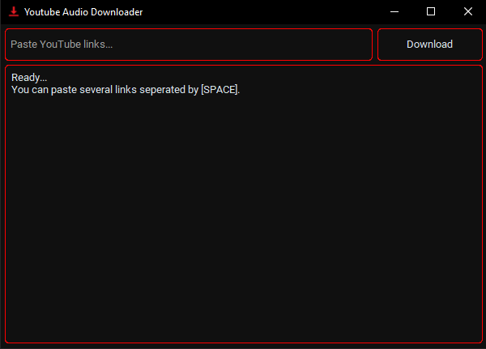

# Youtube Audio Downloader

A simple GUI app to download Youtube Audio.



## Requirements
- Python 3.7+
- Libraries: `customtkinter`

## Installation
1. Clone the repository:
   ```bash
   git clone https://github.com/PETROUNKNOWN/audio_linkDownloader.git

2. Install the required libraries:
    ```bash
    pip install customtkinter

3. Run the Program.    

## Hash
SHA256: 3c3a719e8e7a967a9971d2db59aacfff5e374eb65377f962f0da08cbabd5ade4<br>
MD5: 520a7879061ee2c3f405b9ebc57b00b5<br>

<!-- syndicat -->